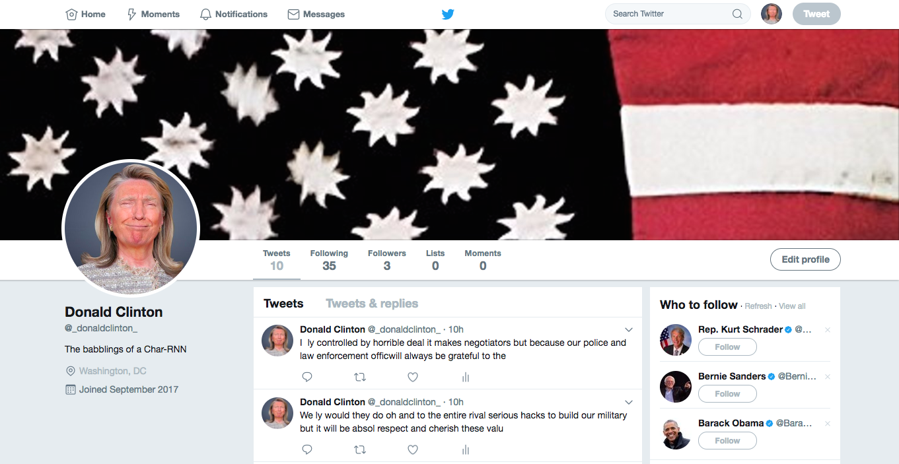

# donald-clinton

A Deep Learning Twitter bot mash-up trained on Donald Trump and Hilary Clinton's US
Presidential debate transcript.

This is a flask application which serves a pre-trained TensorFlow model.

# Instructions

First build the docker image:

`docker build -t flask-app .`

Then run the docker image, mapping the UWSGI server on port 80 to any local port you choose, e.g. 5000:

`docker run -p 5000:80 -it flask-app`

You should then be able to use `curl` to test the server:

`curl localhost:5000`
